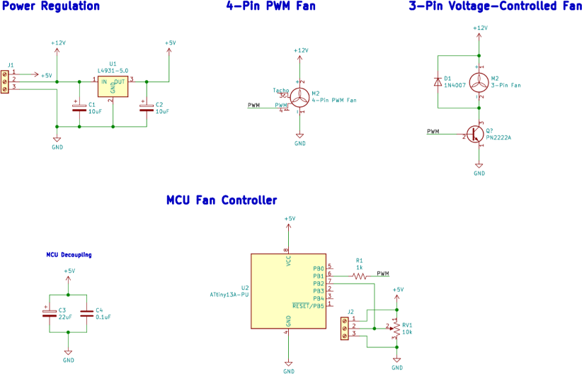

# ATtiny13A PWM Fan Controller
Have an old piece of gear with a noisy VAC fan? This simple project might just work for you. Using a tiny 8-pin microcontroller, you can control the PWM duty cycle of a 3-pin CPU case fan and alter its RPM using a simple potentiometer.

This project was original designed to replace the fan in a Fender MX5200 mixer power supply to reduce the noise in a small home studio. Because of that, the only available supply voltage is 12v, requiring that a small linear regulator be used to provide the proper voltage (5v) to the MCU and PWM signals. If a well regulated 5v supply is already available to you, you may not need that portion of the circuit.

Because of the simplicity of the project and the need for a steady 25khz PWM signal, the firmware for the ATtiny was written without the Arduino Bootloader. You will need a global installation of avr-gcc to compile this code. A copy of avrdude for Windows is included in order to program the MCU with [Arduino ISP](https://www.arduino.cc/en/tutorial/arduinoISP).

